# Projet Business Intelligence

_Readme is wrote exclusively in French as it concerns french data..._   

## Équipe Transparence Santé :

* BENALI Myriam
* BESSON Cécile
* CARDOSO MORENO Ineida
* NAAJI Dorian
* VIRARAGAVANE Smaïline

Le repos contient :

- Un dossier de data analytics avec une Application R Studio Shiny et un Jupyter Notebook.
- Un dossier talend permettant l'ETL des données de transparence santé.
- Un dossier de reporting contenant un fichier Power BI pour l'analyse de KPIs.

## Exécution et installation du projet TALEND

Le repository github doit **impérativement** être cloné dans le dossier **"C:\BI\transparence-sante"**, à la racine du disque dur. L'ensemble des instructions concernent uniquement un projet **TALEND** sous Windows.

### Téléchargement des données

Après avoir cloné le projet, il est possible de télécharger et de dézipper automatiquement les données les plus volumineuses grâce au script PowerShell :

> download-data.ps1

Pour exécuter ce script, il faut :
* Ouvrir une fenêtre Powershell
* Exécuter `C:\BI\transparence` puis '.\download-data.ps1'.
* **Si l'exécution du script est impossible en raison de la politique de sécurité PowerShell de la machine**, il suffit de copier/coller l'ensemble du contenu du sript Powershell dans une fenêtre Powershell.
* Le téléchargement, la décompression et la supression des .zip se fait ensuite automatiquement.

### Création de l'entrepôt de données

Un [script .sql](script_dw.sql) est fourni à la racine du projet, `script_dw.sql`.

### Ouverture du projet Talend

Premièrement, vous devez installer Talend Open Studio for Data Integration, version 2020 7.3.1 :

[Talend releases (download)](https://www.talend.com/fr/products/data-integration-manuals-release-notes/)

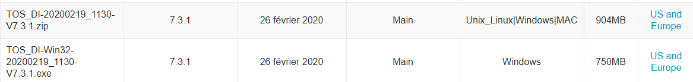

**⚠ Le .zip contient la v. 64 bits, à prendre de préférence**

Une fois Talend installé et lancé, vous devez ajouter une connexion, via le bouton "Gérer les connexions", situé en bas de l'écran pour le premier lancement ou en haut à droite.

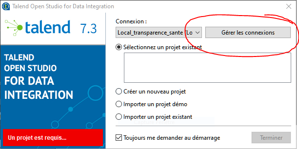

Dans le menu qui suit, remplacez la connexion existante par la suivante :

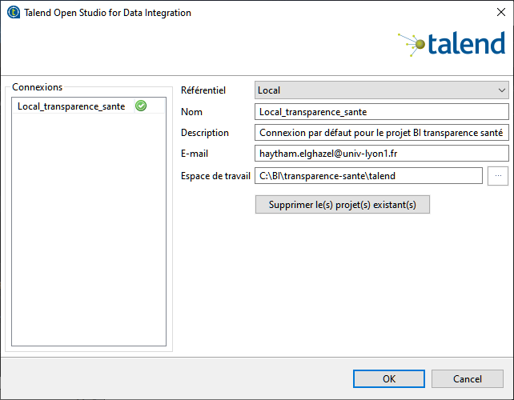

Ensuite, cliquez sur "Importer un projet existant", et sélectionner "TRANSPARENCE_SANTE_BI" dans le dossier talend du repos git.

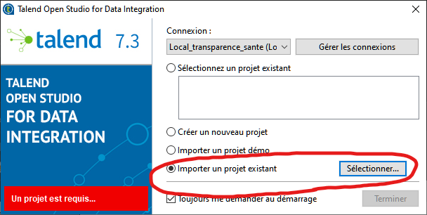

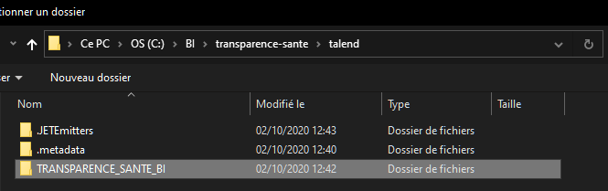

Vous pouvez ensuite lancer le projet.

Concernant GIT, travaillez bien sur vos jobs respectifs et il ne devrait pas y avoir de conflits.

### Remarques diverses

- Si vous avez des problèmes de parsing avec avant_montant_ttc, passez le type en String dans vos tMaps.
- Dans vos tFileInputDelimited, cochez bien la case "SCV Options" et laissez **Escape char** à la valeur **"""**, cela aura pour effet
d'éviter du _shifting_ de colonnes et par conséquent des erreurs inévitables dans vos jobs.
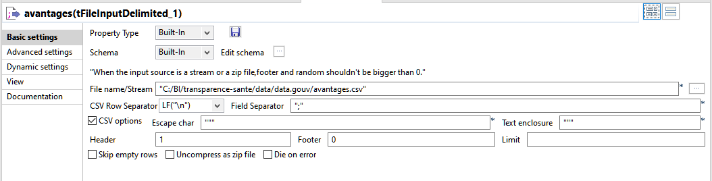

## Informations supplémentaires

### Introduction

Notre équipe de projet va travailler sur la base de données publique "Transparence santé".

_La base de données publique Transparence - Santé rend accessible l'ensemble des informations déclarées par les entreprises sur les liens d'intérêts qu'elles entretiennent avec les acteurs du secteur de la santé. Pilotée par le ministère chargé de la santé, cette initiative de transparence vise à préserver la nécessaire relation de confiance entre les citoyens, les usagers et les multiples acteurs du système de santé._

_Conformément à l’article L. 1453-1 du code de la santé publique, les entreprises produisant ou commercialisant des produits à finalité sanitaire ou cosmétique doivent rendre publics les avantages,les rémunérations accordés aux différents acteurs intervenant dans le champ de la santé, notamment aux professionnels de santé, ainsi que l’existence des conventions conclues avec ces acteurs._

***

Plus d'informations ici :

> [Base de données transparence santé](https://www.transparence.sante.gouv.fr/flow/main)

> [Téléchargement des données](https://www.data.gouv.fr/fr/datasets/transparence-sante-1/#)

### Minimisation

Le jeu de données fourni par [data.gouv](https://www.data.gouv.fr/fr/datasets/transparence-sante-1/#) est très volumineux, d'autant plus une fois décompressé.

Volumétrie :

* declaration_avantage_2020_09_13_04_00 : `3.35 Go` (12 270 172 lignes)
* declaration_convention_2020_09_13_04_00 : `1.85 Go` (5 662 329 lignes)
* declaration_remuneration_2020_09_13_04_00 : `171 Mo` (614 365 lignes)
* entreprise_2020_09_13_04_00 : `398 Ko` (3316 lignes)

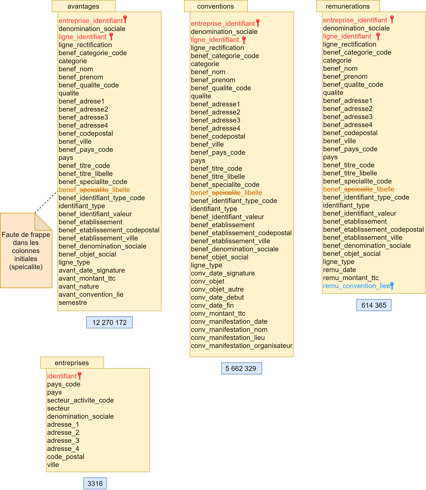

_Figure 2 : Données initiales._

C'est pourquoi nous avons créé un jeu données minimisé, chacun gardant uniquement les "top 10 000 rows" de chaque fichier. Il permet d'ouvrir et de visualiser plus facilement les données. Ces données permettront également de réaliser des tests avant de passer à la totalité des données par exemple.

Ces données minimisées sont accessibles ici :

> [Données minimisées](https://drive.google.com/drive/u/1/folders/13usR34gBdYmK-vbN75WcTykQwk_k7UNv)

Un classeur Excel (format .xlsx) est également disponible ; il compile sous 4 feuilles l'ensemble des données minimisées, mises en forme de manière plus lisible, avec une page d'informations concernant les données.

> [Classeur Excel](https://drive.google.com/drive/u/1/folders/1oBV562rBlshWmhQNVUK9Dj7FCexN-Cul) (Accessible également sur le drive).

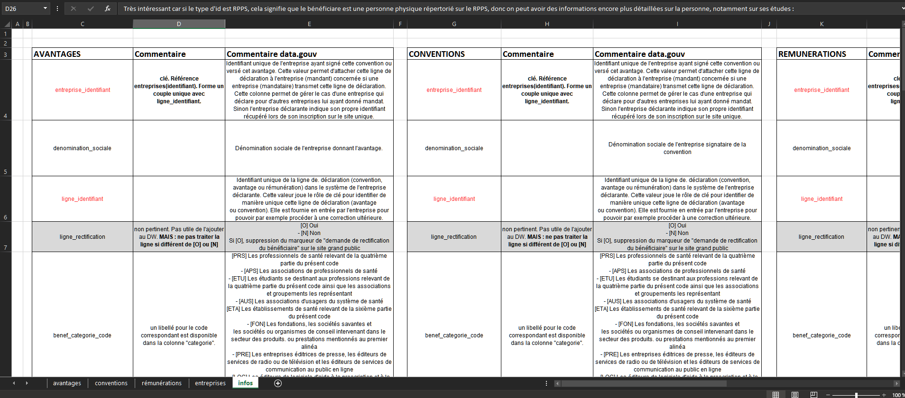

_Figure 3 : Classeur excel._

### Autres fournisseurs de données

D'autres sources de données peuvent nous être utile, notamment, nous avons trouvé plusieurs fichiers :

* dep_region.csv & communes-departement-region.csv  : Issus de [data.gouv](https://www.data.gouv.fr/fr/datasets/communes-de-france-base-des-codes-postaux/) ces fichiers peuvent nous aider à remplir la dimension des adresses.
* rpps_diplomes.csv : acessible  sur [annuaire.sante.fr](https://annuaire.sante.fr/web/site-pro/extractions-publiques), ce fichier nous permet, à partir d'un code unique attribué à un professionnel de santé (numéro RPPS) de récupérer des informations le concernant. Nous utiliserons un fichier permettant de connaître les études du professionnel de santé, nous permettant d'éventuelles analyses. Cela ne concerne que les bénéficiaires des avantages/conventions/rémunérations.

__L'ensemble de ces .csv sont [téléchargeables via ce lien](https://drive.google.com/drive/u/1/folders/1vtv_6EpDKFH28VDju73cSLOCoIsbZm8E)__.

### Entrepôt de données

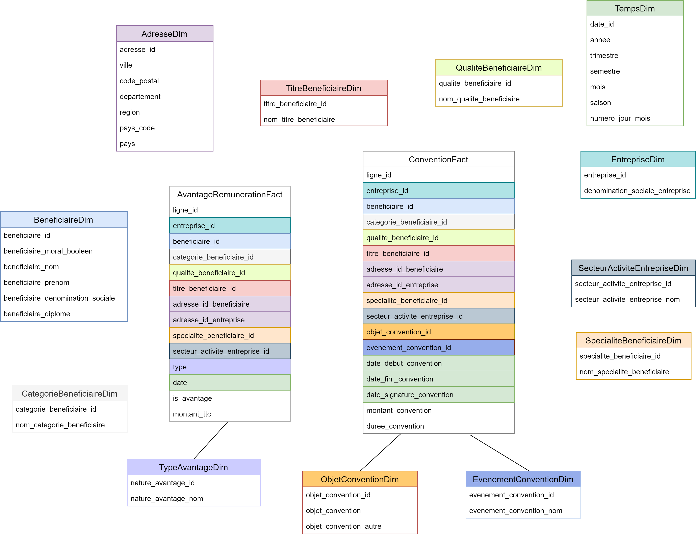

_Figure 5 : Data Warehouse_

La documentation complète et approfondie du Data Warehouse est [accessible via ce lien](https://drive.google.com/file/d/13fV43BG9R4jcuzYYeOUEEuiQJr4eCWgQ/view?usp=sharing).

### Indicateurs clé de performance (KPIs)

Ces KPIs sont donnés à titre informatif et pourront évoluer au long du projet si de nouveaux KPIs pertinents sont trouvés.

#### Avantages

> Quelles sont les villes/pays où les entreprises font le plus appel à des acteurs du secteur de la santé en échange d’avantages ? 

> Quelles sont les 5 premières professions de santé les plus demandées par les entreprises ?

> Quelles sont les 5 premières spécialités les plus recherchées par les entreprises ?

> Quel est en moyenne le montant des frais engendrés pour payer l’avantage au bénéficiaire ?

> Ce montant est-il plus ou moins élevé selon la ville, le poste, la spécialité du bénéficiaire ?

> Quels sont les principaux avantages accordés par les entreprises ? - Certaines entreprises font-elles plus appel à des prestataires que d’autre en échange d’avantages ? 

> Quelle est le montant moyen des avantages en fonction des  régions/départements/villes ?

#### Conventions

> Quelle est la durée moyenne d’une convention ? 

> Certaines entreprises établissent-elle significativement plus de conventions que d’autres ?

> Y-t-il un lien entre le nombre de convention établies entre une entreprise et une prestation selon la ville ou la spécialité ?

> Quel est le montant moyen d’une convention ? En fonction des villes, régions, départements ?

> Le moment de l’année influence-t-il la signature des conventions ?

> De quel secteur sont issues les entreprises signant le plus de conventions ? Nombre de conventions signées en fonction du secteur d’entreprise.

> Quels sont les objets de convention les plus récurrents ? Les plus chers ?

> Zone géographique des bénéficiaires/entreprises en fonction du montant moyen de la convention

#### Rémunérations

> Quel est le montant moyen d’une rémunération ?

> Certains professionnels sont-ils mieux rémunérés que d’autres selon la ville, leur poste, leur spécialité ? 

> Certaines entreprises font-elles plus appel à des prestataires que d’autres en échange d’une rémunération ? 

> Quelle est la rémunération moyenne en fonction des  régions/départements/villes ?

> Quel secteur d’entreprise fournit les plus grosses rémunérations ? les plus faibles ? montant moyen des rémunérations en fonction du secteur ? en fonction de la qualité du bénéficiaire ?

> La date / moment de l’année / saison influence-t-elle le montant des rémunérations ?

### Gestion de projet :

Un drive dédié au partage des différents documents et données liés au projet est disponible à [l'adresse suivante](https://drive.google.com/drive/folders/1orHH_Rj6-e6WtoIDvJkt2NaLoqz8yUAa?usp=sharing)

Nous gérons aussi nos tâches via un formalisme simple via Trello, un outil en ligne de collaboration.

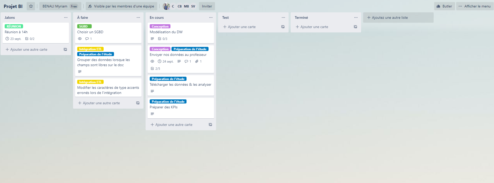
_Figure 5 : Organisation des tâches._

[Il est accessible ici (click me)](https://trello.com/b/9vA5ZWl4/projet-bi).

### Lancement de l'application Shiny

- Lancer le script app.R du dossier "data-analytics" sur R Studio.
- L'application Shiny s'ouvre
- Descendre en bas de la page et cliquer sur le bouton "Visualisation des fichiers"
- Une première pop up souvre : cliquer sur "Ok"
- Au bout de 2 minutes, une deuxième pop up s'ouvre : cliquer sur "Ok"
- Une troisième pop up s'ouvre : cliquer sur "Ok"

==> Vous pouvez à présent naviguer sur tous les onglets de l'application.

### Reporting

Reporting réalisé sous Power BI, voir le dossier "data-reporting"

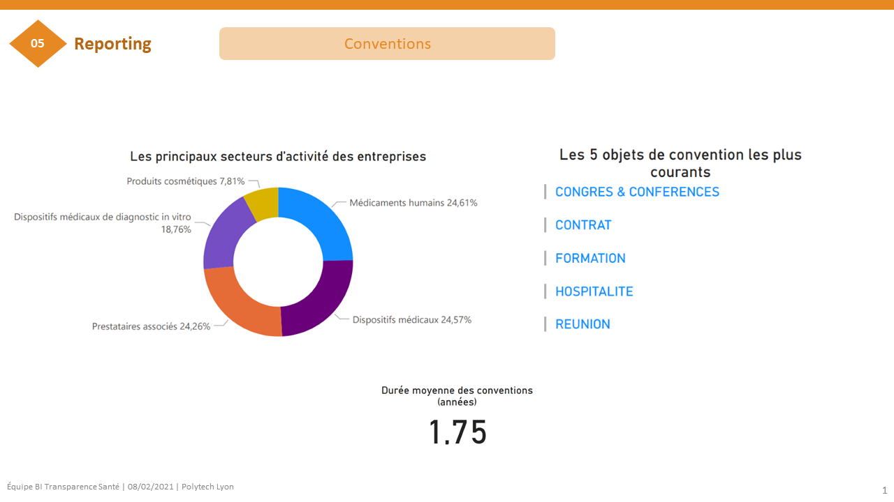

***

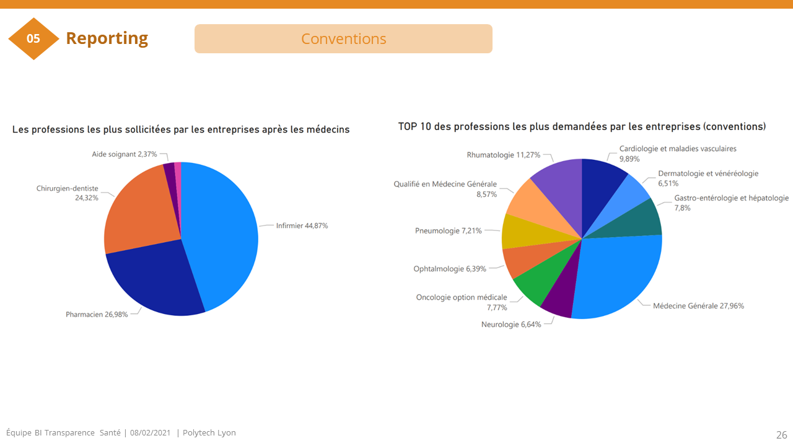
